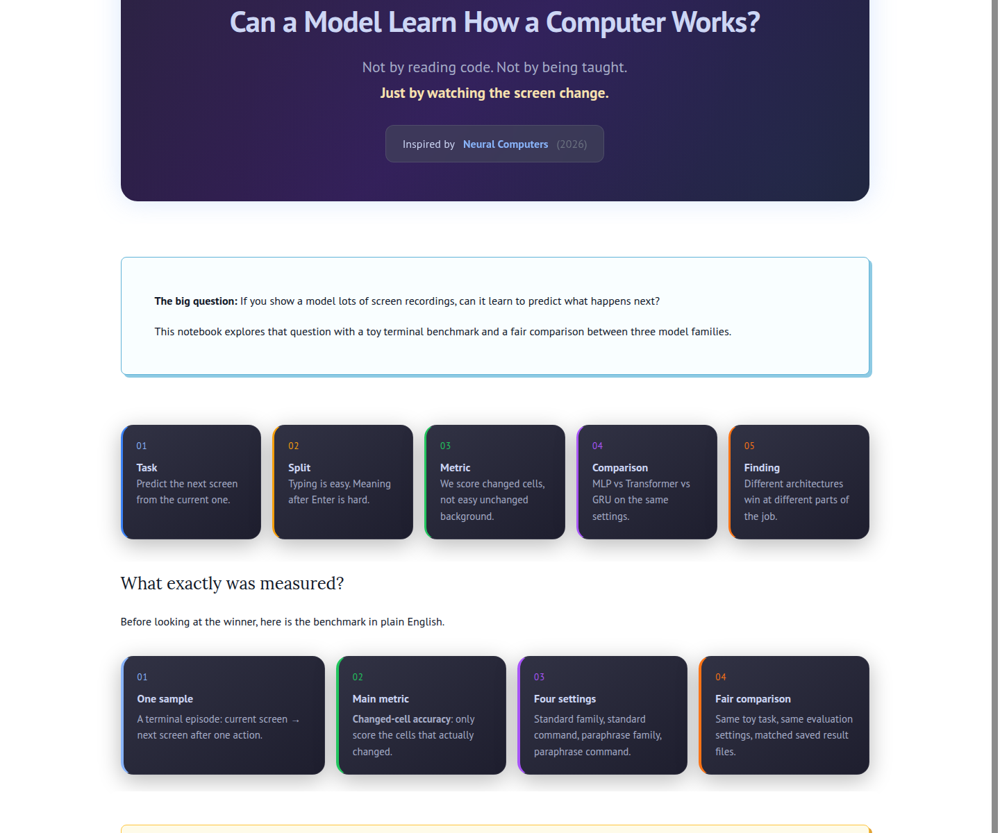
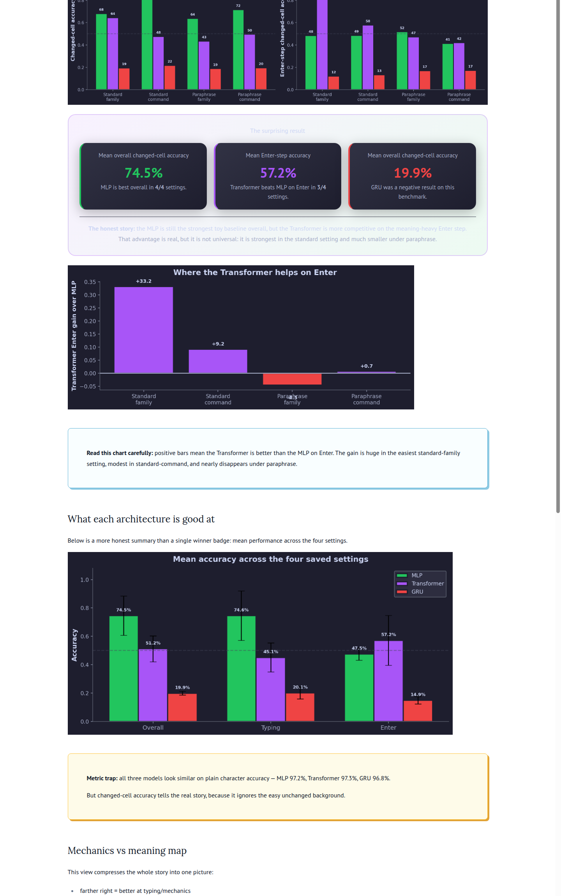

# tiny-neural-os

A toy, visualization-first marimo project inspired by **Neural Computers** (Zhuge et al., 2026).

> Can a model learn how a computer works just by watching the screen change?

This repo explores that question with a tiny terminal benchmark, matched baseline experiments, and a competition-ready interactive notebook.

## Project snapshot

<p align="center">
  
</p>

<p align="center">
  
</p>

## Recommended artifact

If you only open one thing, start here:

- **Notebook source:** `notebooks/neural_computers_competition.py`
- **Rendered HTML:** `outputs/rendered/neural_computers_competition.html`

## What the notebook now includes

- a polished hero / pitch section
- a plain-English benchmark protocol section
- a lightweight live toy-terminal walkthrough
- side-by-side baseline comparison charts
- a Transformer-vs-MLP Enter gain chart
- a mechanics-vs-meaning tradeoff map
- an exact benchmark table
- a competition-style takeaway section grounded in saved results

## Main result

On the saved toy benchmark runs in this repo:

- **MLP** is the strongest overall baseline on changed-cell accuracy.
- **Transformer** is the most interesting contrast model because it is relatively stronger on **Enter** steps.
- **GRU** is a negative result on this benchmark.

Important limitation:

- The Transformer advantage on Enter is **not universal**. It is strongest in the standard setting and shrinks sharply under paraphrase.

## Repo layout

- `notebooks/`
  - marimo notebooks
  - canonical competition notebook: `neural_computers_competition.py`
  - earlier exploratory notebook variants kept for reference
- `experiments/toy_nc_cli/`
  - toy terminal environment
  - baselines and experiment scripts
  - saved results used by the notebook
- `notes/`
  - experiment memos, audits, and verification notes
- `outputs/`
  - rendered notebook HTML and handoff docs
- `assets/`
  - README screenshots generated from the notebook
- `scripts/`
  - export and screenshot helper scripts

## Run the notebook

```bash
python -m venv .venv
source .venv/bin/activate
pip install -r requirements.txt
marimo edit notebooks/neural_computers_competition.py
```

## Export the notebook

```bash
bash scripts/export_competition_notebook.sh
```

## Refresh the README screenshots

```bash
bash scripts/capture_readme_screenshots.sh
```

## Benchmark files used by the notebook

- `experiments/toy_nc_cli/results/mlp_matched_results.json`
- `experiments/toy_nc_cli/results/transformer_results.json`
- `experiments/toy_nc_cli/results/gru_results.json`
- `experiments/toy_nc_cli/results/baseline_comparison.csv`

## Sources

- Neural Computers (2026): https://arxiv.org/abs/2604.06425
- Mamba-3 (2026): https://arxiv.org/abs/2603.15569
- Mamba repository: https://github.com/state-spaces/mamba
